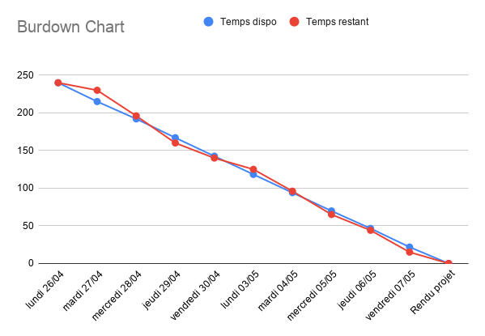

# Burndown Chart du premier sprint

Afin d'appuyer le sérieux de notre démarche, nous vous proposons de découvrir l'organisation horaire que nous avons préparés. Le projet sera donc réalisé par 4 développeurs expérimentés, travaillant à temps plein. Notre méthodologie de gestion de projet que nous vous avons présenté précédemment mobilise une partie du volume horaire disponible de l'équipe.

Le tableau ci-dessous est une représentation des différentes disponibilités de notre équipe pendant la première période de développement.

| Temps disponible prévisionnel | RH1 | RH2 | RH3 | RH4 |
| :--- | :--- | :--- | :--- | :--- |
| Lundi 26/04 | 6,25 | 6,25 | 6,25 | 6,25 |
| Mardi 24/04 | 5,25 | 6 | 6,25 | 5,5 |
| Mercredi 25/04 | 6,25 | 6,25 | 6,25 | 6,25 |
| Jeudi 26/04 | 6 | 6,25 | 6 | 6,25 |
| Vendredi 27/04 | 6,25 | 6 | 6,25 | 5,75 |
| Lundi 03/05 | 6,25 | 5,75 | 6 | 6,25 |
| Mardi 04/05 | 5,75 | 6 | 6,25 | 6,25 |
| Mercredi 05/05 | 6,25 | 6,25 | 5,75 | 5 |
| Jeudi 06/05 | 6,5 | 6 | 6,25 | 6 |
| Vendredi 07/05 | 4,25 | 6 | 5,5 | 6 |

A partir de ce tableau, nous pouvons réaliser un BurnDown Chart représentant le temps disponible de chacun des membres durant la journée et permettant d'avoir une visualisation de ces disponibilités au fur et à mesure du déroulement de la période.


Ce document permet d'être réactif et de visualiser rapidement toute problématique apparaissant durant la période.


