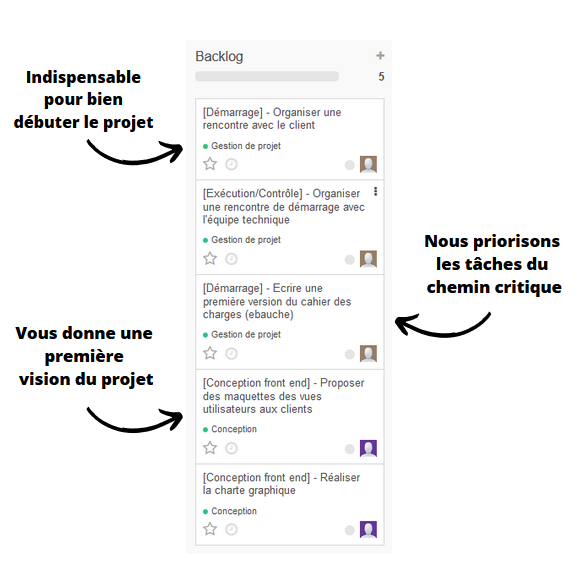

# Présentation du Product Backlog

Voici un aperçu de la méthode de travail que notre équipe a imaginé pour ce projet.


Le chemin critique représente la liste des tâches bloquantes pour le projet. Ces tâches ont une priorité plus élevé.


Notre équipe s'investit sur cette mission avec une gestion de projet mobilisant des méthodes Agiles reconnues pour allier une grande souplesse et efficacité lors de la réalisation de projet informatique.

Dans ce cadre, voici une courte présentation de l'organisation que nous avons planifié pour la première période de travail appelé Sprint n°1.

Le Sprint n°1 débutera avec une réunion de lancement qui permettra d'affiner d'avantage notre compréhension votre besoin tout en validant la planification déjà établie. Dans la foulée, une réunion avec l'équipe technique sera organisée dans le but de leur présenter le projet. Suite à ces réunions, une ébauche du cahier des charges et la réalisation de maquettes devrait être les prochaines étapes. Vous profiterez donc rapidement d'un aperçu du design, des fonctionnalités et des spécificités techniques du projet. Enfin la dernière étape consistera à réaliser la charte graphique avec votre coopération afin de personnaliser le produit selon ses goûts.

