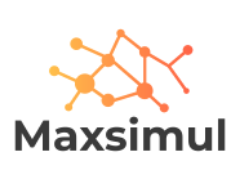

# Présentation de l'entreprise

Maxsimul est une société de formation spécialisée dans la conception et l’animation de Business Games Pédagogiques.

Nous développons des simulateurs d’entreprise, des scénarios et des animations qui permettent de créer des formations innovantes, basées sur la création d’expérience pour les participants et l’acquisition de compétences en plus des connaissances.

Maxsimul a été créé en 2010 et joui d'une forte expérience dans son domaine, ce qui lui a permit d'être leader français depuis 2016. L'entreprise est basée en France mais réalise également plusieurs missions à l'étranger.

Les membres de l'équipe sont les suivants : 

**Morris Sebastian :** Responsable Technique Développement  
**Lasteyrie Bastien :** Responsable Technique Développement  
**Saadi Mehdi :** Responsable Technique Développement  
**Perez Kevin :** Responsable Technique Système et Sécurité

