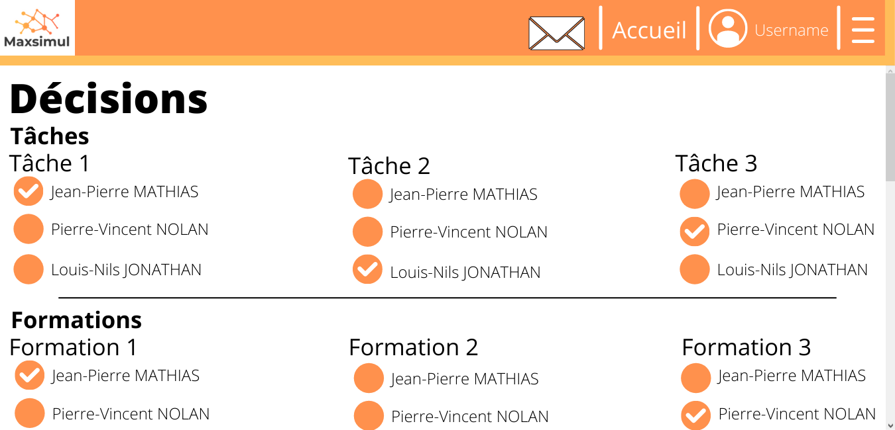
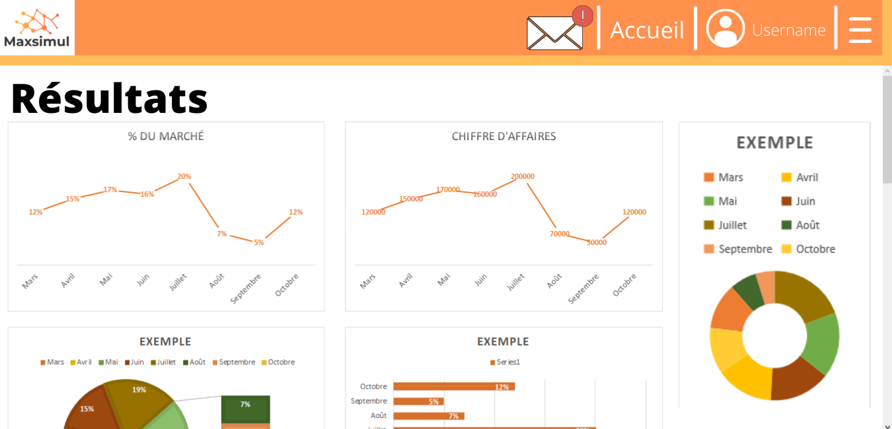

# Présentation des maquettes

Voici une présentation de quelques maquettes que nous avons préparé pour mettre en avant un aperçu de ce à quoi pourrait ressembler le business game pédagogique.  
Vous trouverez trois exemples, d'abord une page de connexion, ensuite une page qui montrent la partie décision du jeu et enfin une page qui montrent les résultats du dit jeu.

