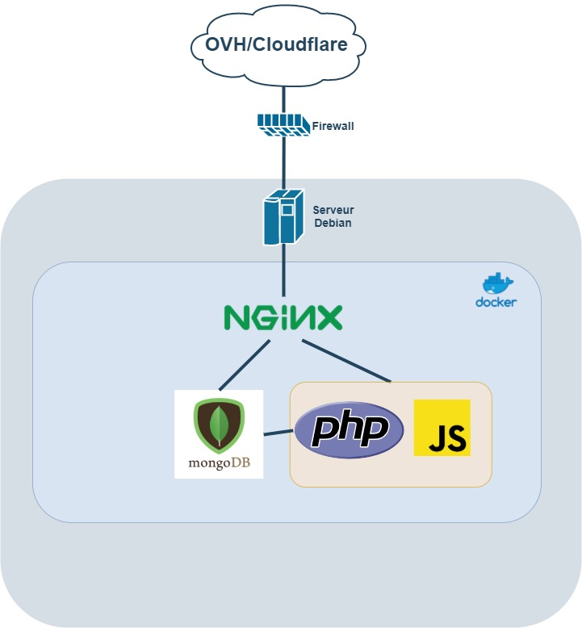

# Sécurisation de l'application

### Solution Anti-DDOS

Notre équipe a pris en compte votre souhait d'utiliser OVH, toutefois nous souhaitons vous proposer une solution alternative "Cloudflare". Cette solution apporte plusieurs améliorations pour proposer une meilleur expérience client.

Cloudflare peut agir en façade de votre application, en étant la vitrine de l'application. Cela permet de ne pas exposer l'IP de votre serveur coté client. Le client n'a aucune connaissance de l'IP de la machine. La seule qui puisse voir est celle de Cloudflare qui change très souvent. En plus de cela Cloudflare est de loin une meilleur solution pour l'anti DDOS, car leur réseau est mondial.

Un autre avantage de Cloudflare est son système de cache qui permet de délivrer directement de lui même les contenus statiques à vos clients. Cela représente un gain de temps lors de l'affichage, mais aussi une réduction de nombre de requêtes vers votre serveur.

Cloudflare\(CDN\) de part sa présence mondiale, permet aussi de délivrer les contenus à la même vitesse que vos clients soient à l'étranger ou en France.

Divers autres services sont proposés par Cloudflare, avec par exemple, des certificats SSL gratuits automatiquement renouvelés.


CloudFlare agit en tant que barrière devant votre serveur



### Traefik

Notre équipe a pris en compte votre souhait d'utiliser Nginx en tant que reverse proxy. Toutefois, nous souhaitons vous proposer une alternative "Traefik" qui est un outil Français spécialement conçu pour simplifier la mise en place de reverse proxy avec Docker.

Il suffit de 4 lignes pour externaliser l'accès à un conteneur via Traefik.

De plus, Traefik permet le renouvellement automatique de certificat et l'utilisation de certificats Wildcard.

### Firewall

Pour sécuriser les accès au serveur, nous recommandons la mise en place d'un Firewall dans le but de limiter les accès sur certains ports. Par exemple, il peut être intéressant de limiter les accès à certains pays uniquement afin de limiter les attaques en provenance des Pays de l'Est.

### Rkhunter

Nous recommandons la mise en place de cet outil sur le serveur Debian afin de protéger le serveur de différents Rootkit. Des commandes sont disponibles pour savoir si le système à été compromis, et des options permettent l'envoi de mail automatiquement si des changements sur le systèmes ont lieux.


Une commande permet de définir un état du système à l'instant T. Si cet état change, alors on peut être notifié du changement.


### Fail2Ban

Cet outil permet de protéger les accès SSH en limitant les attaques par bots. Il permet de limiter par exemple la connexion à partir d'une IP si celle-ci à fait X erreurs. Ensuite, une IP peut être bannie durant X heures.

Fail2ban permet aussi de sécuriser les accès ftp et d'autres services.

### Persistance des données

Pour réaliser la persistance des données de l'application et de la base de données, il nous suffit de monter des volumes dans les dockers en provenance de l'hôte.


Les données sont sauvegardées sur la machine hôte. Il suffit de réaliser un Crontab pour copier la base de données vers un stockage externe.


### Votre infrastructure



### Exemple de Docker-Compose

```text
version: '3.9'
services:
  mongo:
    image: mongo
    restart: unless-stopped
    environment:
      MONGO_INITDB_ROOT_USERNAME: root
      MONGO_INITDB_ROOT_PASSWORD: PASSWORD
    volumes:
      - ./<your-local-path>:/data/db
      
  # Permet l'accès à la bdd depuis le web.
  mongo-express:
    image: mongo-express
    restart: unless-stopped
    ports:
      - 8081:8081
    environment:
      ME_CONFIG_MONGODB_ADMINUSERNAME: root
      ME_CONFIG_MONGODB_ADMINPASSWORD: PASSWORD
  nginx:
    image: nginx
    restart: unless-stopped
    volumes:
      - ./docker/nginx/.htpasswd:/etc/nginx/.htpasswd:ro
      - ./docker/nginx/nginx.conf:/etc/nginx/nginx.conf:ro
      - ./docker/nginx/config:/etc/nginx/conf.d:ro
      - ./projects:/srv/projects
      - ./docker/nginx/acme-challenge:/usr/share/nginx/html:ro
    ports:
      - "80:80"
      - "443:443"
  php-8:
    image: php-8
    restart: unless-stopped
    env_file:
      - mongodb.env
    volumes:
      - ./docker/php-8/config/msmtprc:/etc/msmtprc:ro
      - ./docker/php-8/config/php.ini:/usr/local/etc/php/conf.d/my.ini:ro
      - ./docker/php-8/config/www.conf:/usr/local/etc/php-fpm.d/www.conf:ro
      - ./docker/php-8/composer/:/root/.composer/
      - ./projects/:/srv/projects/
```

